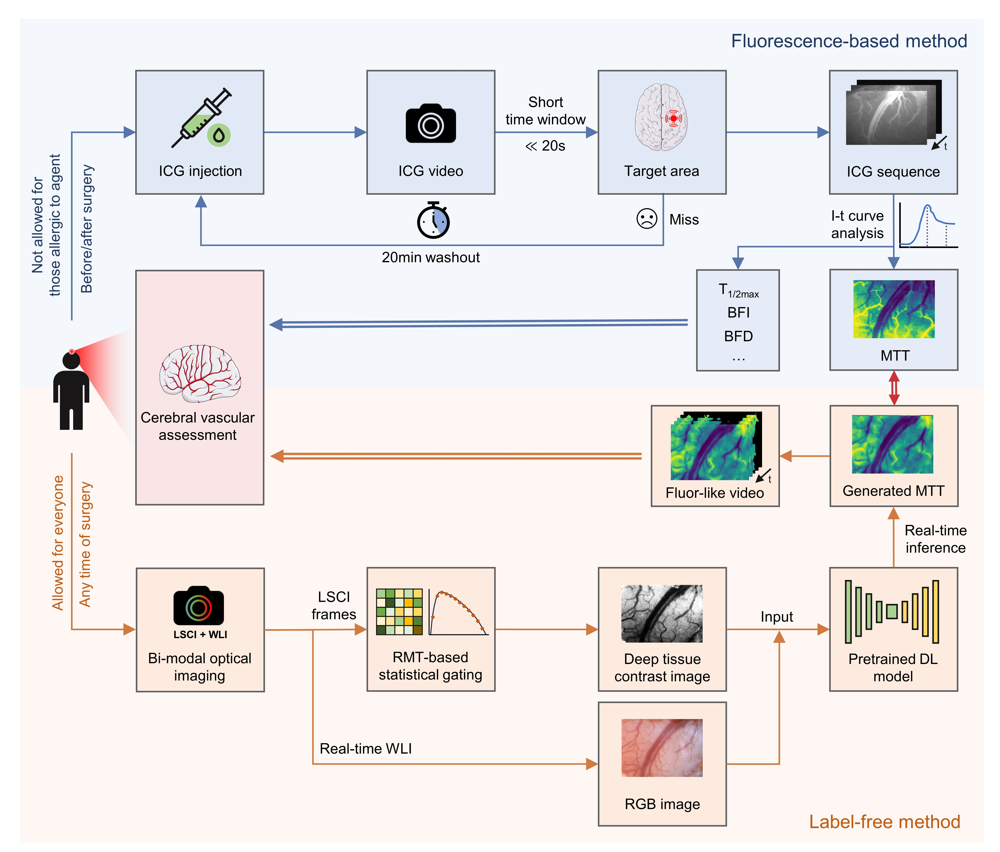

[//]: # (This directory provides definitions for a few common models, dataloaders, scheduler,)

[//]: # (and optimizers that are often used in training.)

[//]: # (The definition of these objects are provided in the form of lazy instantiation:)

[//]: # (their arguments can be edited by users before constructing the objects.)

[//]: # (They can be imported, or loaded by `model_zoo.get_config` API in users' own configs.)


# Generating Mean Transition Time (MTT) Images from Label-Free Optical Imaging Using MA-DenseUNet

This repository contains the code for generating Mean Transition Time (MTT) images of indocyanine green (ICG) fluorescence imaging from label-free optical imaging modalities, including Laser Speckle Contrast Imaging (LSCI) and White Light Imaging (WLI). This work leverages the Mixed Attention Dense UNet (MA-DenseUNet) model, which integrates dense blocks and mixed attention mechanisms into the UNet architecture to enhance feature extraction and accurately generate MTT images.

## Overview

In modern neurosurgical procedures, especially in minimally-invasive and robot-assisted surgeries, accurate visualization of hemodynamics is crucial. However, agent-related issues associated with traditional fluorescence imaging can pose challenges. To address this, our approach focuses on using deep learning to generate MTT images from label-free modalities, offering comprehensive hemodynamic information that can assist surgeons in differentiating arteries from veins and understanding blood flow direction.

We collected multimodal brain vascular images of rats and validated the proposed method on this rat data. This validation demonstrates the effectiveness of our approach in a preclinical setting, providing further evidence of its potential utility in real-world applications.



### Key Contributions
1. **Statistical Gating**: Applied to laser speckle contrast images to match the imaging depth of fluorescence imaging.
2. **MA-DenseUNet Model**: Integrates dense blocks and mixed attention mechanisms into UNet for enhanced feature extraction and improved global and local context capture.
3. **Fluorescence-like Video Extraction**: Extracted from the generated MTT images to visually present blood flow direction, providing surgeons with intuitive and direct hemodynamic information.

For detailed information, please refer to our paper: [xxx].

## Repository Structure
In this repository, we have customized the required model, dataloaders, scheduler, optimizer, loss, and evaluation according to Detectron2's training requirements.

- `recipes/`: Contains recipes for training and evaluating MA-DenseUNet model.
- `configs/`: Contains corresponding configuration files associated with the recipes.
- `data/`: Contains the script for data loading and transforms.
- `modeling/`: Contains the implementation of the MA-DenseUNet model and related scripts model training.
- `evaluation/`: Contains the script for evalution model.
- `CAM/`: Contains Grad-CAM utils.
- `common/`: Contains scripts for loss function, optimizer, schedule and split-combine strategy in evaluation.
- `scr/`: Contains examples of data with their json file, checkpoint, and figures. 

## Getting Started

### Prerequisites

This repository leverages Meta's [Detectron2](https://github.com/facebookresearch/detectron2) as the training framework. We have introduced a custom k-fold Trainer and base utils for our projects to extend its functionality. To use this, you need to install our modified branch of Detectron2:
```bash
git clone -b sy/for_generative_MTT https://github.com/MPAPS2019/detectron2.git
cd detectron2
python setup.py install
```
Other required packages include:
- Python 3.9
- PyTorch
- Other dependencies as listed in `requirements.txt`

### Installation

Clone this repository and install the required packages:

```bash
git clone https://github.com/MPAPS2019/GenerativeMTT.git
cd GenerativeMTT
pip install -r requirements.txt
```

### Training MA-DenseUNet model
1. **Prepare the Data**
   - Organize dataset-related information into a JSON file for both training dataset and test dataset. See instructions for [data preparation](data/README.md).

2. **Configure Training Parameters**
   - Set the training parameters in the configuration file, see [example](configs/baseline_MADenseUNet_kfold.py). Adjust hyperparameters, model settings, and other configuration options as needed.

3. **Start Training**
   - Here presents two training recipes:
     - [`lazyconfig_train_net.py`](recipes/lazyconfig_train_net.py): using `AMPTrainer` with all training data.
     - [`lazyconfig_train_net_kfold.py`](recipes/lazyconfig_train_net_kfold.py): using `AMPTrainerKfold` with k-fold validation method.
   - Begin training using one of scripts with corresponding configuration file. The terminal command is as follows:

     ```bash
     python <path-to-script-file> --config-file <path-to-config-file>
     ```
     
4. **Continue your Training**
   - If your training us interrupted, you can resume training using the following command:
   
     ```bash
     python <path-to-script-file> --config-file <path-to-config-file> --resume
     ```
     The training will continue from your last saved checkpointer.


### Evaluating model
   - You can evaluate the model after training by specifying the saved checkpoint file. You can set global value `INIT_CHECKPOINT` as your checkpointer path in configuration file, then run the command
   
     ```bash
     python <path-to-script-file> --config-file <path-to-config-file> --eval-only 
     ```
     
     or using the command directly:
   
     ```bash
     python <path-to-script-file> --config-file <path-to-config-file> --eval-only train.checkpoint=<path-to-checkpoint-file>
     ```
     
   - You can also evaluate the model during training:
     - When using `lazyconfig_train_net.py` to train all data, you can customize the frequency of evaluations during training by setting the `EVAL_EPOCH`.
     - When using `lazyconfig_train_net_kfold.py` for k-fold validation, evaluation is performed every epoch, and average metrics are obtained for every k epochs.
   
   - Set `SAVE_CAMS=True` in config file and `self.target_layers` in class `MTTGenerator` when you want to output attention weight maps for specified layers using Grad_CAM.

## Data Availability
Only example data are provided in this repository. The full datasets used in this work are not publicly available here. To request access to the complete raw data, please contact the corresponding author of our paper.

## Citation
If you find this work useful, please cite our paper:

```bibtex
@article{your_paper_reference,
  title={Your Paper Title},
  author={Your Name and Others},
  journal={Journal Name},
  year={2024},
  volume={XX},
  number={X},
  pages={XX-XX},
  doi={10.XXXX/XXXXXX}
}
```
